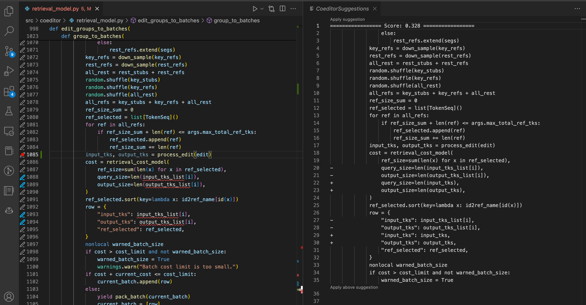

# Coeditor Extension for VSCode

AI-powered Python code change suggestion using the Coeditor transformer model.

*It's like GitHub Copilot but for suggesting where and how to make code changes.*



## Features

- The extension is designed to work with Git projects and the model will condition its prediction on all the changes you made since the latest commit.
- The command `Coeditor: Suggest edits for selection` use the current cursor location or text selection (if multiple lines are selected) to determine which lines to edit. The target line region will be displayed as pencil icons on the left editor margin. You can also access this command from the editor context menu by right-clicking (available in `.py` files only). [**Watch demo on Youtube**](https://youtu.be/S-lrUhgxfMU)
- The command `Coeditor: Suggest edits` will reuse the target line region established by `Suggest edits for selection` (when the cursor is inside the previous line region) or establish a new line region when current cursor is outside or has a text selection. You can run this command repeatedly each time you make additional edits to the target region. The `Coeditor: run on save` option controls whether to automatically run the this command everytime you save the editor. [**Watch demo on Youtube**](https://youtu.be/A6GH_BEVFR8)


## Installing the Model

**Note: the model codebase is currently private and will be released soon. Stay tuned!**
- First, install the Coeditor codebase on your machine locally.
- Then, start the suggestion service by running the command below inside the model's directory:
```bash
pipenv run python scripts/start_server.py
```
- The service will by default start at `http://localhost:5042`..
- Note that currently, the server needs to be on the same machine as your source code in order for the server to query the git history.

## Extension Settings

- `coeditor.serverURL`: The URL of the suggestion service. Default to `http://localhost:5042`.
- `coeditor.writeLogs`: Whether to write logs to the `<project>/.coeditor_logs`. Default to `false`. The logs containing the input and output directly seen by the model and are useful for debugging.

## Usage Tips
- If the model doesn't suggest the desired edit, you can hint the model by making more changes inside the target line region and run `Coeditor: suggest edits` again.
- If the extension is behaving unexpectedly, you can check what the model saw by opening the log file at `<project>/.coeditor_logs` (if `coeditor.writeLogs` is set to `true`).

### Known Issues

- The current implementation can only be used to edit a single statement span but not headers. This means that the target line region must be inside the body of a single function or a statement span inside a class body.
- Currently, the service directly reads and writes to the files on disk, so the commands
will first save the file before calling the service.

## Release Notes
See [CHANGELOG.md](CHANGELOG.md).

