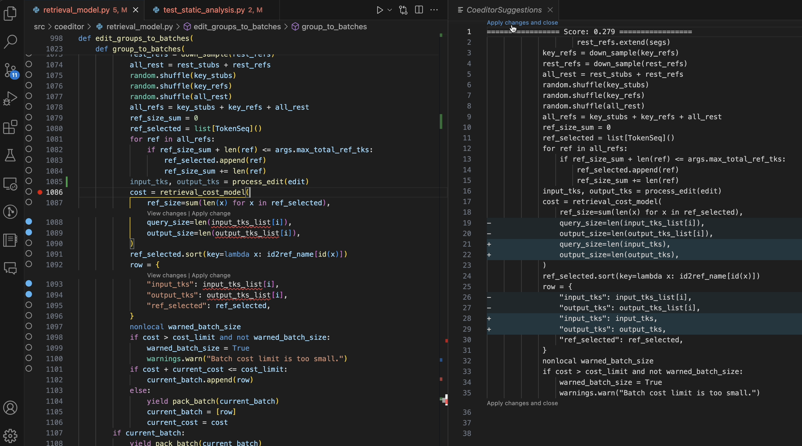

# Coeditor Extension for VSCode

AI-powered Python code change suggestion using the [Coeditor model](https://github.com/MrVPlusOne/Coeditor).

*It's like GitHub Copilot but for auto-completing your code edits.* Watch [how Coeditor works](https://youtu.be/hjZE__jslzs) on Youtube.

## Features

- The model makes code change prediction by conditioning on all the changes you made since the latest commit (tracked by Git).
- The command `Coeditor: Suggest edits for selection` uses the current cursor location or text selection (if multiple lines are selected) to determine which lines to edit. The target line region will be displayed in the editor margin. You can also access this command from the editor context menu by right-clicking (available in `.py` files only).
- The command `Suggest edits again` runs the model again by reusing the cursor location from the last time. When the suggestion panel is kept open, this command will automatically be called on file save (when `rerunOnSave` is true).
- The command `Apply suggested edits and close` will apply the suggested edits and close the suggestion panel. 
- When `backgroundOnSave` is true (default false), the model will suggest edits on the background when the user saves a file and offer to view the results by displaying code lenses in the input.

## Installing the Model

Currently, the model needs to be run on the same machine that the extension is running on. It uses http to communicate with the VSCode extension, and all communications are local. To install the model, follow the steps below:

- First, clone the [Coeditor model codebase](https://github.com/MrVPlusOne/Coeditor) to the target machine. Follow the instructions there to install the dependencies.
- Then, [start the VSCode extension server](https://github.com/MrVPlusOne/Coeditor#use-the-vscode-extension-server).

## Usage Tips

- If the model doesn't suggest the desired edit, you can hint the model by making more changes inside the target line region and query the model again.
- If the extension is behaving unexpectedly, you can check what the model saw by opening the log file at `<project>/.coeditor_logs` (if `coeditor.writeLogs` is set to `true`).

### Known Issues

- The current implementation can only be used to edit a single statement span but not headers. This means that the target line region must be inside the body of a single function or a statement span in-between functions. The target line region cannot span across multiple functions.
- Currently, the service directly reads and writes to the files on disk, so the commands will first save the file before calling the service.

## Release Notes
See [CHANGELOG.md](CHANGELOG.md).

